# Metro-Widgets

Kacheln im Stil von Windows 8 („Metro UI“): farbige Kacheln mit Ikone, Beschriftungsstreifen und Abzeichen, Kacheln,
die einen Dialog öffnen, Bedienelemente für Dimmer, Rollläden und Thermostate sowie ein Schieber, ein Schalter und
eine Checkbox.

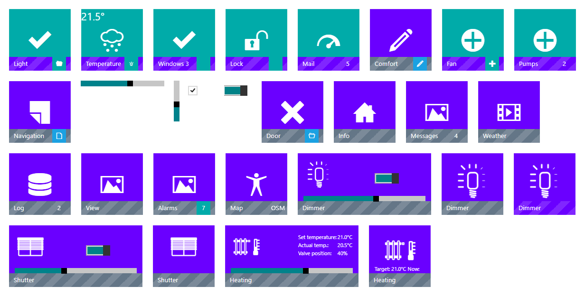

Der Adapter liefert jedes Widget zweimal: für **vis** (vis-1) wie bisher und für **vis-2** als React-Widgets. Beide
haben dieselben Widget-IDs und dieselben Einstellungen, ein vis-Projekt funktioniert in vis-2 also unverändert
weiter - vis-2 zeichnet die Widgets mit der React-Version, die gleich aussieht und sich gleich verhält. Die
React-Widgets brauchen vis-2 2.12.8 oder neuer; ein älteres vis-2 verwendet die vis-1-Widgets.

Die Widgets stehen in der Gruppe **Metro** der Widget-Palette.

- [Gemeinsame Einstellungen](#gemeinsame-einstellungen)
- [Kacheln, die einen Zustand zeigen](#kacheln-die-einen-zustand-zeigen): [Kachel Bool](#kachel-bool),
  [Kachel Bool / Zahl](#kachel-bool--zahl), [Kachel Text](#kachel-text), [Kachel Werteliste 8](#kachel-werteliste-8)
- [Kacheln, die schalten](#kacheln-die-schalten): [Kachel Zustand](#kachel-zustand),
  [Kachel Zustand / Zahl im Abzeichen](#kachel-zustand--zahl-im-abzeichen), [Kachel Umschalter](#kachel-umschalter),
  [Kachel Umschalter / Zahl im Abzeichen](#kachel-umschalter--zahl-im-abzeichen),
  [Kachel Navigation](#kachel-navigation)
- [Bedienelemente](#bedienelemente): [Schieber waagerecht und senkrecht](#schieber-waagerecht-und-senkrecht),
  [Checkbox und Schalter](#checkbox-und-schalter)
- [Kacheln mit Dialog](#kacheln-mit-dialog): [Kachel Bool mit Dialog](#kachel-bool-mit-dialog),
  [Kachel Dialog, View](#kachel-dialog-view), [Kachel Dialog, HTML](#kachel-dialog-html),
  [Kachel Dialog, Zustandstext](#kachel-dialog-zustandstext), [Kachel Dialog, iFrame](#kachel-dialog-iframe)
- [Dimmer, Rollladen und Heizung](#dimmer-rollladen-und-heizung): [Kachel Dimmer](#kachel-dimmer),
  [Kachel Dimmer mit Dialog](#kachel-dimmer-mit-dialog), [Kachel Rollladen](#kachel-rollladen),
  [Kachel Rollladen mit Dialog](#kachel-rollladen-mit-dialog), [Kachel Heizung](#kachel-heizung),
  [Kachel Heizung mit Dialog](#kachel-heizung-mit-dialog)
- [Unterschiede zu vis-1](#unterschiede-zu-vis-1)

## Gemeinsame Einstellungen

Eine Kachel besteht aus dem **Hintergrund**, der **Ikone** in der Mitte, dem **Brand** - dem Streifen unten mit der
Beschriftung - und dem **Abzeichen** am rechten Ende des Streifens.

| Einstellung | Bedeutung |
|---|---|
| Hintergrund, Brand-Hintergrund, Abzeichen-Hintergrund | Farben der Metro-Palette: `bg-*` sind einfarbig, `ribbed-*` gestreift. Der Editor bietet sie in einer Liste mit Muster an. |
| Ikonenklasse, Abzeichenikone | Eine Ikone der Metro-Ikonenschrift (`icon-*`), aus einer Liste gewählt. |
| Icon URL, Abzeichen URL | Ein Bild statt (oder zusätzlich zu) der Ikonenschrift. Breite, Höhe und der Abstand von oben und von links werden in Prozent der Kachel angegeben. |
| Beschriftung | Der Text des Streifens. Beschriftungen dürfen HTML enthalten. |
| Hover-Effekt | Ein Rahmen, solange der Mauszeiger über der Kachel ist. |
| Druckeffekt | Die Kachel neigt sich zu der Stelle, an der sie gedrückt wird. |
| Selektieren bei Wahr / Selektieren bei Wert | Ein Rahmen um die Kachel, solange der Zustand wahr ist (oder den Wert hat). |

Viele Kacheln haben von jeder Farbe, Ikone und Beschriftung zwei Varianten: **... bei Falsch** und **... bei Wahr**.
Die Kachel zeigt die Variante, die zum Zustand passt: falsch sind `false`, `0`, `"0"`, `"false"`, ein leerer Wert und
gar kein Wert - alles andere ist wahr.

Die **Dialog**-Einstellungen der Dialog-Kacheln:

| Einstellung | Bedeutung |
|---|---|
| Titel | Titel des Dialogs (HTML erlaubt). Manche Kacheln nehmen stattdessen die Beschriftung. |
| Dialogbreite, Dialoghöhe | Größe in Pixeln. Ohne Größe richtet sich der Dialog nach seinem Inhalt. |
| Flaches Design | Ein flaches Fenster ohne den blauen Rahmen. |
| Fensterschatten | Ein Schatten um das Fenster. |
| Verschiebbar | Der Dialog lässt sich an seiner Titelleiste verschieben. |
| Modaldialog | Die Seite hinter dem Dialog wird abgedunkelt. |
| Ikonen-URL, Ikonenklasse | Eine Ikone in der Titelleiste. |

Es ist immer nur ein Dialog offen. Solange er offen ist, reagiert die Seite dahinter nicht - ob modal oder nicht -,
und der Dialog schließt sich mit dem × in der Titelleiste.

## Kacheln, die einen Zustand zeigen

### Kachel Bool

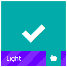

`tplMetroTileBool` - zeigt einen booleschen Zustand: Hintergrund, Ikone, Beschriftung, Streifen und Abzeichen haben je
eine Variante für Wahr und Falsch.

| Einstellung | Bedeutung |
|---|---|
| Objekt-ID | Der angezeigte Zustand. |
| Beschriftung bei Falsch / Beschriftung bei Wahr | Die Beschriftung des Streifens. |

### Kachel Bool / Zahl

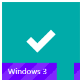

`tplMetroTileBoolNumber` - wie Kachel Bool, dazu steht der Wert eines Zahlen-Zustands in der Beschriftung.

| Einstellung | Bedeutung |
|---|---|
| Zustand ID | Der boolesche Zustand, der die Variante wählt. |
| Nummer ID | Die Zahl hinter der Beschriftung, gefolgt von **Nach Beschriftung** (z. B. einer Einheit). |

### Kachel Text

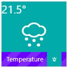

`tplMetroTileString` - zeigt den Wert eines Zustands als Text; Farben und Ikonen folgen einem zweiten, booleschen
Zustand.

| Einstellung | Bedeutung |
|---|---|
| Inhalt ID | Der Zustand, dessen Wert auf der Kachel steht (HTML erlaubt), mit **Inhaltsprefix** und **Inhaltsuffix** drumherum. |
| Zustand ID | Der boolesche Zustand, der die Variante wählt. |
| Beschriftung ObjectID | Die Beschriftung kommt aus diesem Zustand, mit **Vor Beschriftung** und **Nach Beschriftung** drumherum. |

### Kachel Werteliste 8

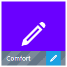

`tplMetroTileList8` - zeigt eines von acht Aussehen, gewählt durch die Zahl 0 bis 7 eines Zustands: Beschriftung,
Hintergrund, Ikone, Abzeichenikone, Abzeichen- und Streifenfarbe gibt es je Zahl einmal (**Beschriftung [0]** ...
**Beschriftung [7]** usw.). `true` zählt als 1, `false` als 0.

## Kacheln, die schalten

### Kachel Zustand

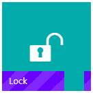

`tplMetroTileState` - ein Klick schreibt einen festen Wert; die Kachel zeigt, ob der Zustand diesen Wert hat.

| Einstellung | Bedeutung |
|---|---|
| Zustand ID | Der Zustand, der geschrieben wird. |
| Wert | Der Wert, den ein Klick schreibt. `true`/`false` werden als Wahrheitswerte geschrieben, Zahlen als Zahlen (`5`), alles andere als Text - `01` zum Beispiel bleibt der Text „01“. Ohne Wert wird ein leerer Text geschrieben. |
| Selektieren bei Wert | Ein Rahmen, solange der Zustand den Wert hat. |

### Kachel Zustand / Zahl im Abzeichen

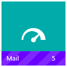

`tplMetroTileStateNumber` - wie Kachel Zustand, mit dem Wert der **Nummer ID** im Abzeichen.

### Kachel Umschalter

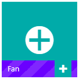

`tplMetroTileToggle` - ein Klick schaltet die **Objekt-ID** um: `false`, ein leerer oder gar kein Wert wird zu
`true`, `true` zu `false`. Eine Zahl wird zu `0`, wenn sie 0,5 oder größer ist, sonst zu `1`.

Mit den Einstellungen der Gruppe **Andere Zustände steuern** schaltet die Kachel stattdessen andere Zustände:

| Einstellung | Bedeutung |
|---|---|
| Objekt-ID bei Wahr / Objekt-ID bei Falsch | Wird statt der Objekt-ID geschrieben; ohne **Objekt-ID bei Falsch** gilt die für Wahr für beide. |
| Wert bei Wahr / Wert bei Falsch | Die geschriebenen Werte. |
| URL bei Wahr / URL bei Falsch | Wird beim Klick aufgerufen; ohne **URL bei Falsch** wird beide Male die für Wahr aufgerufen. |

Welche Seite gilt, entscheidet die Objekt-ID: ist sie an (`true`, `1`), gilt die Seite „Falsch“, sonst die Seite
„Wahr“. Ohne Objekt-ID merkt sich die Kachel den letzten Klick und wechselt mit jedem Klick die Seite.

### Kachel Umschalter / Zahl im Abzeichen

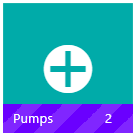

`tplMetroTileToggleNumber` - wie Kachel Umschalter, mit dem Wert der **Nummer ID** im Abzeichen.

### Kachel Navigation

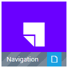

`tplMetroTileNav` - öffnet die **Zu öffnende View**. Solange diese angezeigt wird, trägt die Kachel ihre aktiven
Farben (**Aktiver Hintergrund**, **Aktiver Brand-Hintergrund**, **Aktiver Abzeichen-Hintergrund**), mit **Aktuelle
View selektieren** auch einen Rahmen. **Seitenhintergrund** setzt beim Öffnen der View den Hintergrund der Seite.

## Bedienelemente

### Schieber waagerecht und senkrecht

 

`tplMetroSlider`, `tplMetroSliderVertical` - ein Schieber, der den Wert schon beim Ziehen schreibt.

| Einstellung | Bedeutung |
|---|---|
| Objekt-ID | Der Zustand. |
| Min, Max | Der Bereich; ohne Angabe 0 bis 1. `true` wird als Max angezeigt, `false` als Min. |
| Schritt | Die geschriebenen Werte werden auf diesen Schritt gerundet. |
| Schieberfarbe gefüllt, Schiebergrifffarbe | Die Farben des gefüllten Teils und des Griffs. |

### Checkbox und Schalter

 

`tplMetroValueBoolCheckbox`, `tplMetroValueBoolSwitch` - eine Checkbox oder ein Ein/Aus-Schalter für einen booleschen
Zustand, mit freiem HTML davor und danach (**HTML davor**, **HTML danach**). Ein Klick schreibt `true` oder `false`.

## Kacheln mit Dialog

Ein Klick auf diese Kacheln öffnet einen Dialog. Die Kachel selbst hat einen Hintergrund, eine Ikone
(**Ikonenklasse** oder **Icon URL**), eine Beschriftung und ein Abzeichen.

### Kachel Bool mit Dialog

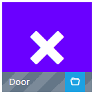

`tplMetroTileBoolDialog` - eine Kachel Bool, deren Klick die **View im Dialog** öffnet.

### Kachel Dialog, View

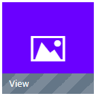 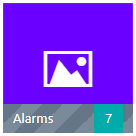

`tplMetroTileDialog`, `tplMetroTileDialogNumber` - ein Klick öffnet die **View im Dialog**. Die zweite zeigt den Wert
der **Nummer ID** im Abzeichen, solange er über 0 liegt.

### Kachel Dialog, HTML

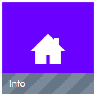 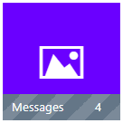

`tplMetroTileDialogStatic`, `tplMetroTileStaticDialogNumber` - ein Klick öffnet einen Dialog mit dem festen
**Dialoginhalt (HTML)**. Die Kachel zeigt den Wert der **Inhalt ID** neben der Ikone, die zweite zusätzlich eine
Zahl im Abzeichen.

### Kachel Dialog, Zustandstext

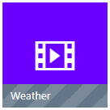 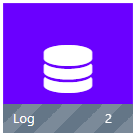

`tplMetroTileDialogString`, `tplMetroTileStringDialogNumber` - ein Klick öffnet einen Dialog mit dem Wert der
**Dialog ID** (HTML erlaubt), in der **Dialogschriftgröße**, mit dem **Dialog-Innenabstand** und der
**Dialogtextausrichtung**. Der Dialog folgt Änderungen des Zustands, solange er offen ist.

### Kachel Dialog, iFrame

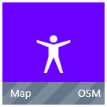

`tplMetroTileFrameDialogNumber` - ein Klick öffnet die **Dialog URL** in einem Rahmen; **Scroll im iFrame** erlaubt
das Blättern. Das Abzeichen zeigt den **Abzeichentext**, die Kachel den **Inhalt** neben der Ikone.

## Dimmer, Rollladen und Heizung

### Kachel Dimmer

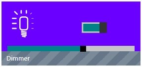

`tplMetroTileDimmer` - eine breite Kachel mit einer Lampe in elf Stufen, einem Schalter und einem Schieber für die
**Objekt-ID**.

| Einstellung | Bedeutung |
|---|---|
| Min, Max | Der Bereich des Dimmers. Der Schalter schreibt Max und Min. **Beide angeben** - ohne sie funktioniert der Schieber nicht, wie in vis-1. |
| Schritt | Die Werte des Schiebers werden auf diesen Schritt gerundet. |
| Schieberfarbe, Schieberfarbe gefüllt, Schiebergrifffarbe | Die Farben des Schiebers. |

### Kachel Dimmer mit Dialog

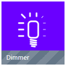 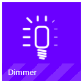

`tplMetroTileDimmerDialog`, `tplMetroTileDimmerDialogactiv` - eine Kachel mit der Lampe; ein Klick öffnet Schalter und
Schieber in einem Dialog. Ohne Min und Max ist der Bereich 0 bis 1. Mit **Nachkommastellen** schreibt der Schieber
den Wert mit so vielen Nachkommastellen (als Text). Die zweite Kachel färbt ihren Streifen mit
**Brand-Hintergrund bei Wahr**, solange der Dimmer an ist, und mit **Brand-Hintergrund bei Falsch**, solange er aus
ist.

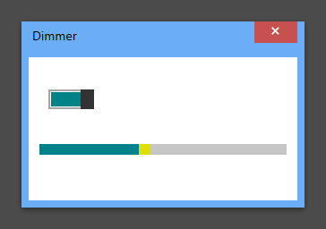

### Kachel Rollladen

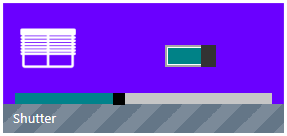

`tplMetroTileShutter` - eine breite Kachel mit einem Fenster in elf Stufen, einem Schalter und einem Schieber für die
**Objekt-ID**. Das Fenster ist bei Max offen und bei Min geschlossen. Solange die **In Arbeit Zustand ID** wahr ist,
behält der Schalter seine Stellung.

### Kachel Rollladen mit Dialog

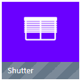

`tplMetroTileShutterDialog` - eine Kachel mit dem Fenster; ein Klick öffnet Schalter und Schieber in einem Dialog.

### Kachel Heizung

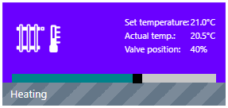

`tplMetroTileHeating` - eine breite Kachel mit Soll- und Ist-Temperatur, Ventilstellung und Luftfeuchtigkeit und einem
Schieber für die Soll-Temperatur. Jede Zeile erscheint nur, wenn ihr Zustand gewählt ist; ohne Soll-Temperatur ist
der Schieber ausgeblendet.

| Einstellung | Bedeutung |
|---|---|
| Soll-Temperatur ID | Der Sollwert. Wird ein Zustand mit der Rolle `level.temperature` gewählt, füllt der Editor die noch leeren Zustände desselben Thermostats aus: Ist-Temperatur, Ventil, Luftfeuchtigkeit und Batteriewarnung über ihre Rollen, Kontrollmodus und Fenster über die Namen der Homematic-Thermostate (`CONTROL_MODE`, `WINDOW_STATE`, `WINDOW_OPEN_REPORTING`). |
| Ist-Temperatur ID, Ventilstellung ID, Luftfeuchtigkeit ID | Die übrigen Zeilen. |
| Beschriftung Soll-Temperatur ... Beschriftung Luftfeuchtigkeit | Eigene Texte für die Zeilen. |
| Min, Max, Schritt | Bereich des Schiebers (6 bis 30 °C) und sein Schritt (ohne Angabe 0,1). |
| Kontrollmodus ID, Batteriewarnung ID, Fenstersensor ID | Die Ikonen im Abzeichen: der Kontrollmodus zeigt **Icon Auto Modus** und seine Geschwister für die Werte 0, 1 und 2; Batterie- und Fensterikone erscheinen, solange ihr Zustand wahr ist. |

### Kachel Heizung mit Dialog

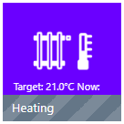

`tplMetroTileHeatingDialog` - zeigt die Temperaturen in Kurzform (**Kurzbeschriftung ...**); ein Klick öffnet einen
Dialog mit einem Schieber für die Soll-Temperatur und den drei Werten.

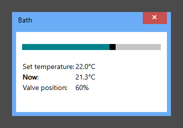

## Unterschiede zu vis-1

Die vis-2-Widgets bilden die vis-1-Widgets genau nach - jedes Widget, jeder geöffnete Dialog und jeder Klick wurde mit
den Originalvorlagen verglichen, Pixel für Pixel und Schreibvorgang für Schreibvorgang. Dazu gehören auch einige
Eigenheiten von vis-1, die erhalten blieben, damit bestehende Projekte gleich aussehen:

- Das Abzeichenbild von Kachel Bool, Kachel Bool mit Dialog und Kachel Umschalter ist immer die **Abzeichen-URL bei
  Falsch**.
- Kachel Umschalter wählt ihre Ikone nach dem reinen Wert: die Texte „false“ und „0“ zeigen die Ikone für Wahr,
  während alles andere auf der Kachel Falsch zeigt.
- Der Schalter der Dimmer- und Rollladen-Kacheln ist bei jedem Wert außer 0, false und leer an - nicht erst über der
  Mitte von Min und Max.
- Kachel Dimmer funktioniert nicht ohne Min und Max (siehe oben).
- Lampe und Fenster zählen `true` als 1, nicht als Max.
- Kachel Umschalter mit **Objekt-ID bei Wahr**, aber ohne **Wert bei Wahr** schreibt einen leeren Text.
- Ein Dialog mit Zustandstext zeigt einen Zustand `null` als „null“; ebenso die Kurzzeile der Heizungs-Dialogkachel.
- Die Standardbeschriftung „Set temperature“ im Heizungsdialog ist nicht übersetzt.

Einige Einstellungen hatten in vis-1 keine Wirkung und werden nicht mehr angeboten; im Projekt gespeicherte Werte
bleiben erhalten und werden wie bisher nicht beachtet:

| Widget | Einstellung |
|---|---|
| Kachel Zustand / Zahl im Abzeichen | Abzeichen-Hintergrund, Verbergen bei 0 |
| Kachel Umschalter / Zahl im Abzeichen | Verbergen bei 0, Abzeichen-Hintergrund bei Falsch / bei Wahr |
| Dialog-Kacheln mit Zahl im Abzeichen | Verbergen bei 0 |
| Kachel Navigation | die Effekte beim View-Wechsel (Ausblend-/Einblendeffekt, Dauer, Optionen, Sync) - vis-2 wechselt Views selbst |
| Schieber waagerecht und senkrecht | Schieberfarbe, In Arbeit Zustand ID |
| Kachel Dimmer mit Dialog, aktiver Streifen | Brand-Hintergrund, das automatische Schließen des Dialogs |

Zwei Dinge funktionieren besser als in vis-1: der Heizungsdialog zeigt die Werte auch, wenn ein Zustand ein Text ist
(vis-1 zeigte einen leeren Dialog), und die Schieber messen sich neu, wenn das Widget in der Größe verändert wird.
